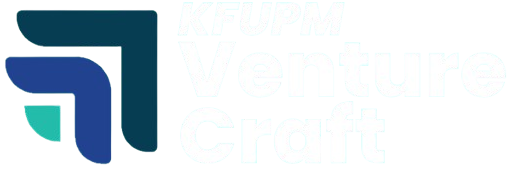

# Venture Craft

**Pioneering the future of sustainable innovation.**

Venture Craft is a premier global startup competition initiative by the KFUPM Entrepreneurship Institute. This platform connects emerging founders, showcases innovative ideas, and facilitates the journey from concept to venture.

 *<!-- Ideally verify if logo exists or leave generic placeholder -->*

## 🚀 Overview

This repository contains the source code for the official Venture Craft website. Built with cutting-edge web technologies, it features a modern, immersive design that reflects the forward-thinking nature of the competition.

### Key Features

*   **Immersive Hero Section**: Interactive 3D World Map visualization.
*   **Modern Design System**: Dark-themed UI with "Glassmorphism" effects, sophisticated gradients, and smooth animations.
*   **Responsive Layout**: Fully optimized for mobile, tablet, and desktop devices.
*   **Purpose & Mission**: A dedicated section highlighting the core values of the initiative with custom typography (Poppins & Inter).

## 🛠️ Tech Stack

*   **Framework**: [Next.js 16](https://nextjs.org/) (App Router)
*   **Language**: [TypeScript](https://www.typescriptlang.org/)
*   **Styling**: [Tailwind CSS 4](https://tailwindcss.com/)
*   **UI Library**: [React 19](https://react.dev/)

## 📦 Getting Started

Follow these steps to set up the project locally.

### Prerequisites

*   Node.js (v18 or higher recommended)
*   npm or yarn

### Installation

1.  **Clone the repository**:
    ```bash
    git clone https://github.com/maramahg/VentureCraft.git
    cd VentureCraft
    ```

2.  **Install dependencies**:
    ```bash
    npm install
    # or
    yarn install
    ```

3.  **Run the development server**:
    ```bash
    npm run dev
    ```

4.  **Open your browser**:
    Navigate to [http://localhost:3000](http://localhost:3000) to view the application.

## 📂 Project Structure

```bash
venture-craft/
├── public/          # Static assets (images, icons)
├── src/
│   ├── app/         # Next.js App Router pages and layouts
│   ├── components/  # Reusable UI components
│   └── lib/         # Utility functions
├── package.json     # Project dependencies and scripts
└── ...
```

## 🤝 Contributing

Contributions are welcome! Please feel free to submit a Pull Request.

1.  Fork the project
2.  Create your feature branch (`git checkout -b feature/AmazingFeature`)
3.  Commit your changes (`git commit -m 'Add some AmazingFeature'`)
4.  Push to the branch (`git push origin feature/AmazingFeature`)
5.  Open a Pull Request

## 📄 License

[KFUPM Rights Reserved]
